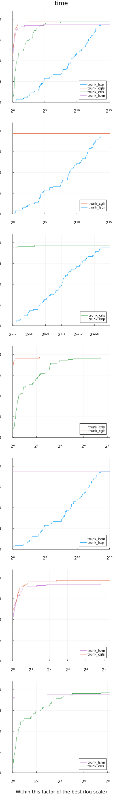

@def title = "Comparing subsolvers for NLS solvers"
@def showall = true
@def tags = ["solvers", "krylov", "benchmark", "least squares"]

\preamble{Tangi Migot}


[](https://jso.dev/OptimizationProblems.jl/stable/)
[](https://jso.dev/SolverBenchmark.jl/stable/)

[](https://jso.dev/ADNLPModels.jl/stable/)
[](https://jso.dev/Krylov.jl/stable/)
[](https://jso.dev/JSOSolvers.jl/stable/)


# Comparing subsolvers for nonlinear least squares in JSOSolvers

This tutorial showcases some advanced features of solvers in JSOSolvers.

```julia
using JSOSolvers
```


We benchmark different subsolvers used in the solver TRUNK for unconstrained nonlinear least squares problems.
The first step is to select a set of problems that are nonlinear least squares.

```julia
using ADNLPModels
using OptimizationProblems
using OptimizationProblems.ADNLPProblems
df = OptimizationProblems.meta
problem_names = df[(df.objtype .== :least_squares) .& (df.contype .== :unconstrained), :name]
ad_problems = (eval(Meta.parse(problem))(use_nls = true) for problem ∈ problem_names)
```

```plaintext
Base.Generator{Vector{String}, Main.var"##WeaveSandBox#277".var"#2#3"}(Main.var"##WeaveSandBox#277".var"#2#3"(), ["arglina", "arglinb", "bard", "bdqrtic", "beale", "bennett5", "boxbod", "brownal", "br
ownbs", "brownden"  …  "power", "rat42", "rat43", "rozman1", "sbrybnd", "spmsrtls", "thurber", "tquartic", "vibrbeam", "watson"])
```


These problems are [`ADNLSModel`](https://github.com/JuliaSmoothOptimizers/ADNLPModels.jl) so derivatives are generated using automatic differentiation.

```julia
nls = first(ad_problems)
typeof(nls)
```

```plaintext
ADNLPModels.ADNLSModel{Float64, Vector{Float64}, Vector{Int64}}
```


The solvers TRON and TRUNK are trust-region based methods that compute a search direction by means of solving iteratively a linear least squares problem.
For this task, several solvers are available.

```julia
JSOSolvers.trunkls_allowed_subsolvers
```

```plaintext
(:cgls, :crls, :lsqr, :lsmr)
```


This benchmark could also be followed for the solver TRON where the following subsolvers are available.

```julia
JSOSolvers.tronls_allowed_subsolvers
```

```plaintext
(:cgls, :crls, :lsqr, :lsmr)
```


These linear least squares solvers are implemented in the package [Krylov.jl](https://github.com/JuliaSmoothOptimizers/Krylov.jl).
For detailed descriptions of each subsolver's algorithm and when to use it, see the [Krylov.jl documentation](https://jso.dev/Krylov.jl/stable/).

We define a dictionary of the different solvers that will be benchmarked.
We consider here four variants of TRUNK using the different subsolvers.

For example, to call TRUNK with an explicit subsolver:

```julia
stats = trunk(nls, subsolver = :cgls)
```

```plaintext
"Execution stats: first-order stationary"
```


The same subsolver selection pattern applies to TRON's least-squares specialization:

```julia
stats_tron = tron(nls, subsolver = :lsmr)
```

```plaintext
"Execution stats: first-order stationary"
```


Now we define the solver dictionary for benchmarking:

```julia
solvers = Dict(
  :trunk_cgls => model -> trunk(model, subsolver = :cgls),
  :trunk_crls => model -> trunk(model, subsolver = :crls),
  :trunk_lsqr => model -> trunk(model, subsolver = :lsqr),
  :trunk_lsmr => model -> trunk(model, subsolver = :lsmr)
)
```

```plaintext
Dict{Symbol, Function} with 4 entries:
  :trunk_lsqr => #12
  :trunk_cgls => #8
  :trunk_crls => #10
  :trunk_lsmr => #14
```


Using [`SolverBenchmark.jl`](https://github.com/JuliaSmoothOptimizers/SolverBenchmark.jl) functionalities, the solvers are executed over all the test problems.

```julia
using SolverBenchmark
stats = bmark_solvers(solvers, ad_problems)
```

```plaintext
Dict{Symbol, DataFrames.DataFrame} with 4 entries:
  :trunk_lsqr => 66×40 DataFrame…
  :trunk_cgls => 66×40 DataFrame…
  :trunk_crls => 66×40 DataFrame…
  :trunk_lsmr => 66×40 DataFrame…
```


The result is stored in a dictionary of `DataFrame` that can be used to analyze the results.

```julia
first_order(df) = df.status .== :first_order
unbounded(df) = df.status .== :unbounded
solved(df) = first_order(df) .| unbounded(df)

costnames = ["time"]
costs = [df -> .!solved(df) .* Inf .+ df.elapsed_time]
```

```plaintext
1-element Vector{Main.var"##WeaveSandBox#277".var"#17#18"}:
 #17 (generic function with 1 method)
```


We compare the four variants based on their execution time.
More advanced comparisons could include the number of evaluations of the objective, gradient, or Hessian-vector products.

```julia
using Plots
gr()

profile_solvers(stats, costs, costnames)
```




The CRLS and CGLS variants are the ones solving more problems, and even though the difference is rather small the CGLS variant is consistently faster which seems to indicate that it is the most appropriate subsolver for TRUNK.
The size of the problems was rather small here, so this should be confirmed on larger instances.
Moreover, the results may vary depending on the origin of the test problems.
