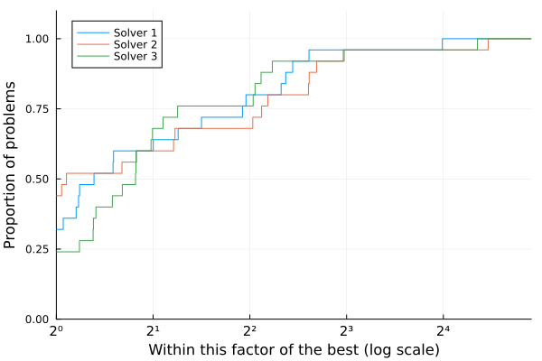

@def title = "Introduction to BenchmarkProfiles"
@def showall = true
@def tags = ["benchmarking"]

\preamble{Abel Soares Siqueira and Dominique Orban}


[](https://jso.dev/BenchmarkProfiles.jl/stable/)


This tutorial demonstrates how to use BenchmarkProfiles.jl to visualize and compare solver performance across multiple test problems.

## Performance Profile

Performance profiles, introduced by Dolan and Moré (2002), provide a graphical way to compare the performance of multiple solvers across a test set. They show the fraction of problems solved by each solver as a function of a performance tolerance.

### Understanding Performance Profiles

The input is a matrix `T` with entries `T[i,j]` indicating the cost to solve problem `i` using solver `j`. Cost can be, for instance, elapsed time, number of iterations, or function evaluations. The cost should be positive. If any cost is zero, all measures will be shifted by 1.

The performance profile plots:
- **x-axis (τ)**: Performance ratio - how much slower a solver is compared to the best solver for each problem. τ=1 means the solver was fastest, τ=2 means it took twice as long as the fastest solver.
- **y-axis (ρ(τ))**: Fraction of problems solved within the performance ratio τ. ρ(2) = 0.8 means the solver solved 80% of problems within twice the time of the best solver.

**Key interpretations**:
- The height at τ=1 (left side) shows the fraction of problems where the solver was fastest
- The right-side height (as τ→∞) shows the fraction of problems successfully solved (robustness)
- Higher curves are better - the solver solves more problems with smaller performance ratios

Basic usage:

```julia
using BenchmarkProfiles, Random, Plots

Random.seed!(0)

T = 10 * rand(25, 3)
performance_profile(PlotsBackend(), T, ["Solver 1", "Solver 2", "Solver 3"])
```




A negative or infinite cost indicates a failure:

```julia
T[2:20,1] .= Inf
performance_profile(PlotsBackend(), T, ["Solver 1", "Solver 2", "Solver 3"])
```


Here's an example with a strongly superior solver.

```julia
T[:,2] = 100T[:,3]
performance_profile(PlotsBackend(), T, ["Solver 1", "Solver 2", "Solver 3"])
```


### Customization Options

`Plots` arguments can be passed to `performance_profile()` or used as they normally would be with `Plots`.
In the example below, we pass `xlabel` to `performance_profile` and set `ylabel` through `ylabel!`.

Common customization options:
- `lw`: Line width
- `c` or `color`: Line colors
- `linestyles`: Line styles (`:solid`, `:dash`, `:dot`, etc.)
- `xlabel`, `ylabel`: Axis labels
- `title`: Plot title
- `legend`: Legend position (e.g., `:bottomright`, `:topleft`)

```julia
using Plots

T = 10 * rand(25, 3)
performance_profile(PlotsBackend(), T, ["Solver 1", "Solver 2", "Solver 3"],
      lw=2, c=:black, linestyles=[:solid, :dash, :dot], xlabel="τ")
ylabel!("ρ(τ)")
```


### Additional Parameters

The `performance_profile` function accepts several optional keyword arguments:

- `logscale::Bool=true`: Use logarithmic scale on the x-axis (default: true). Useful for viewing performance across a wide range of ratios.
- `sampletol::Number=0`: Tolerance for sampling data points. Can reduce plot complexity for large datasets.
- `title::String=""`: Title for the plot

For more details on performance profiles, see: Dolan, E. D., & Moré, J. J. (2002). Benchmarking optimization software with performance profiles. Mathematical Programming, 91(2), 201-213.
