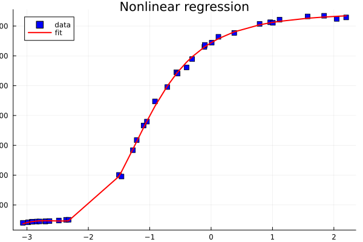
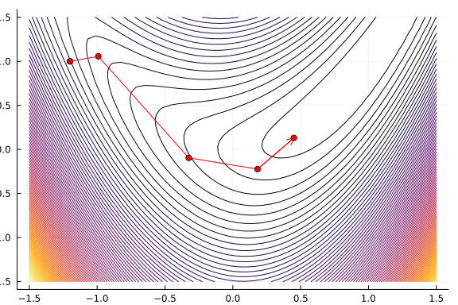

@def title = "Introduction to JSOSolvers"
@def showall = true
@def tags = ["solvers", "nlpmodels", "models"]

\preamble{Tangi Migot}


[](https://juliasmoothoptimizers.github.io/SolverCore.jl/stable/)


[](https://juliasmoothoptimizers.github.io/ADNLPModels.jl/stable/)
[](https://juliasmoothoptimizers.github.io/JSOSolvers.jl/stable/)


\toc

# JSOSolvers.jl Tutorial

This package provides optimization solvers curated by the
[JuliaSmoothOptimizers](https://juliasmoothoptimizers.github.io)
organization.
All solvers are based on [NLPModels.jl](https://github.com/JuliaSmoothOptimizers/NLPModels.jl) and [SolverCore.jl](https://github.com/JuliaSmoothOptimizers/SolverCore.jl).

This package contains the implementation of four algorithms that are classical for unconstrained/bound-constrained nonlinear optimization:
`lbfgs`, `R2`, `tron`, and `trunk`.

## Solver input and output

All solvers have the following signature:

```plaintext
    stats = name_solver(nlp; kwargs...)
```

where `name_solver` can be `lbfgs`, `R2`, `tron`, or `trunk`, and with:
- `nlp::AbstractNLPModel{T, V}` is an AbstractNLPModel or some specialization, such as an `AbstractNLSModel`;
- `stats::GenericExecutionStats{T, V}` is a `GenericExecutionStats`, see `SolverCore.jl`.

The keyword arguments may include:
- `x::V = nlp.meta.x0`: the initial guess.
- `atol::T = √eps(T)`: absolute tolerance.
- `rtol::T = √eps(T)`: relative tolerance, the algorithm stops when $\| \nabla f(x^k) \| \leq atol + rtol \| \nabla f(x^0) \|$.
- `max_eval::Int = -1`: maximum number of objective function evaluations.
- `max_time::Float64 = 30.0`: maximum time limit in seconds.
- `verbose::Int = 0`: if > 0, display iteration details every `verbose` iteration.

Refer to the documentation of each solver for further details on the available keyword arguments.

## Specialization for nonlinear least-squares

The solvers `tron` and `trunk` both have a specialized implementation for input models of type `AbstractNLSModel`.

The following examples illustrate this specialization.

```julia
using JSOSolvers, ADNLPModels
f(x) = (x[1] - 1)^2 + 4 * (x[2] - x[1]^2)^2
nlp = ADNLPModel(f, [-1.2; 1.0])
trunk(nlp, atol = 1e-6, rtol = 1e-6)
```

```plaintext
"Execution stats: first-order stationary"
```


```julia
nlp.counters
```

```plaintext
Counters:
             obj: ████████⋅⋅⋅⋅⋅⋅⋅⋅⋅⋅⋅⋅ 10                grad: ████████⋅⋅⋅⋅⋅⋅⋅⋅⋅⋅⋅⋅ 10                cons: ⋅⋅⋅⋅⋅⋅⋅⋅⋅⋅⋅⋅⋅⋅⋅⋅⋅⋅⋅⋅ 0     
        cons_lin: ⋅⋅⋅⋅⋅⋅⋅⋅⋅⋅⋅⋅⋅⋅⋅⋅⋅⋅⋅⋅ 0             cons_nln: ⋅⋅⋅⋅⋅⋅⋅⋅⋅⋅⋅⋅⋅⋅⋅⋅⋅⋅⋅⋅ 0                 jcon: ⋅⋅⋅⋅⋅⋅⋅⋅⋅⋅⋅⋅⋅⋅⋅⋅⋅⋅⋅⋅ 0     
           jgrad: ⋅⋅⋅⋅⋅⋅⋅⋅⋅⋅⋅⋅⋅⋅⋅⋅⋅⋅⋅⋅ 0                  jac: ⋅⋅⋅⋅⋅⋅⋅⋅⋅⋅⋅⋅⋅⋅⋅⋅⋅⋅⋅⋅ 0              jac_lin: ⋅⋅⋅⋅⋅⋅⋅⋅⋅⋅⋅⋅⋅⋅⋅⋅⋅⋅⋅⋅ 0     
         jac_nln: ⋅⋅⋅⋅⋅⋅⋅⋅⋅⋅⋅⋅⋅⋅⋅⋅⋅⋅⋅⋅ 0                jprod: ⋅⋅⋅⋅⋅⋅⋅⋅⋅⋅⋅⋅⋅⋅⋅⋅⋅⋅⋅⋅ 0            jprod_lin: ⋅⋅⋅⋅⋅⋅⋅⋅⋅⋅⋅⋅⋅⋅⋅⋅⋅⋅⋅⋅ 0     
       jprod_nln: ⋅⋅⋅⋅⋅⋅⋅⋅⋅⋅⋅⋅⋅⋅⋅⋅⋅⋅⋅⋅ 0               jtprod: ⋅⋅⋅⋅⋅⋅⋅⋅⋅⋅⋅⋅⋅⋅⋅⋅⋅⋅⋅⋅ 0           jtprod_lin: ⋅⋅⋅⋅⋅⋅⋅⋅⋅⋅⋅⋅⋅⋅⋅⋅⋅⋅⋅⋅ 0     
      jtprod_nln: ⋅⋅⋅⋅⋅⋅⋅⋅⋅⋅⋅⋅⋅⋅⋅⋅⋅⋅⋅⋅ 0                 hess: ⋅⋅⋅⋅⋅⋅⋅⋅⋅⋅⋅⋅⋅⋅⋅⋅⋅⋅⋅⋅ 0                hprod: ████████████████████ 26    
           jhess: ⋅⋅⋅⋅⋅⋅⋅⋅⋅⋅⋅⋅⋅⋅⋅⋅⋅⋅⋅⋅ 0               jhprod: ⋅⋅⋅⋅⋅⋅⋅⋅⋅⋅⋅⋅⋅⋅⋅⋅⋅⋅⋅⋅ 0
```


```julia
F(x) = [x[1] - 1; 2 * (x[2] - x[1]^2)]
nls = ADNLSModel(F, [-1.2; 1.0], 2)
trunk(nls, atol = 1e-6, rtol = 1e-6)
```

```plaintext
"Execution stats: first-order stationary"
```


```julia
nls.counters
```

```plaintext
Counters:
             obj: ⋅⋅⋅⋅⋅⋅⋅⋅⋅⋅⋅⋅⋅⋅⋅⋅⋅⋅⋅⋅ 0                 grad: ⋅⋅⋅⋅⋅⋅⋅⋅⋅⋅⋅⋅⋅⋅⋅⋅⋅⋅⋅⋅ 0                 cons: ⋅⋅⋅⋅⋅⋅⋅⋅⋅⋅⋅⋅⋅⋅⋅⋅⋅⋅⋅⋅ 0     
        cons_lin: ⋅⋅⋅⋅⋅⋅⋅⋅⋅⋅⋅⋅⋅⋅⋅⋅⋅⋅⋅⋅ 0             cons_nln: ⋅⋅⋅⋅⋅⋅⋅⋅⋅⋅⋅⋅⋅⋅⋅⋅⋅⋅⋅⋅ 0                 jcon: ⋅⋅⋅⋅⋅⋅⋅⋅⋅⋅⋅⋅⋅⋅⋅⋅⋅⋅⋅⋅ 0     
           jgrad: ⋅⋅⋅⋅⋅⋅⋅⋅⋅⋅⋅⋅⋅⋅⋅⋅⋅⋅⋅⋅ 0                  jac: ⋅⋅⋅⋅⋅⋅⋅⋅⋅⋅⋅⋅⋅⋅⋅⋅⋅⋅⋅⋅ 0              jac_lin: ⋅⋅⋅⋅⋅⋅⋅⋅⋅⋅⋅⋅⋅⋅⋅⋅⋅⋅⋅⋅ 0     
         jac_nln: ⋅⋅⋅⋅⋅⋅⋅⋅⋅⋅⋅⋅⋅⋅⋅⋅⋅⋅⋅⋅ 0                jprod: ⋅⋅⋅⋅⋅⋅⋅⋅⋅⋅⋅⋅⋅⋅⋅⋅⋅⋅⋅⋅ 0            jprod_lin: ⋅⋅⋅⋅⋅⋅⋅⋅⋅⋅⋅⋅⋅⋅⋅⋅⋅⋅⋅⋅ 0     
       jprod_nln: ⋅⋅⋅⋅⋅⋅⋅⋅⋅⋅⋅⋅⋅⋅⋅⋅⋅⋅⋅⋅ 0               jtprod: ⋅⋅⋅⋅⋅⋅⋅⋅⋅⋅⋅⋅⋅⋅⋅⋅⋅⋅⋅⋅ 0           jtprod_lin: ⋅⋅⋅⋅⋅⋅⋅⋅⋅⋅⋅⋅⋅⋅⋅⋅⋅⋅⋅⋅ 0     
      jtprod_nln: ⋅⋅⋅⋅⋅⋅⋅⋅⋅⋅⋅⋅⋅⋅⋅⋅⋅⋅⋅⋅ 0                 hess: ⋅⋅⋅⋅⋅⋅⋅⋅⋅⋅⋅⋅⋅⋅⋅⋅⋅⋅⋅⋅ 0                hprod: ⋅⋅⋅⋅⋅⋅⋅⋅⋅⋅⋅⋅⋅⋅⋅⋅⋅⋅⋅⋅ 0     
           jhess: ⋅⋅⋅⋅⋅⋅⋅⋅⋅⋅⋅⋅⋅⋅⋅⋅⋅⋅⋅⋅ 0               jhprod: ⋅⋅⋅⋅⋅⋅⋅⋅⋅⋅⋅⋅⋅⋅⋅⋅⋅⋅⋅⋅ 0             residual: ████████⋅⋅⋅⋅⋅⋅⋅⋅⋅⋅⋅⋅ 14    
    jac_residual: ⋅⋅⋅⋅⋅⋅⋅⋅⋅⋅⋅⋅⋅⋅⋅⋅⋅⋅⋅⋅ 0       jprod_residual: ███████████████⋅⋅⋅⋅⋅ 26     jtprod_residual: ████████████████████ 37    
   hess_residual: ⋅⋅⋅⋅⋅⋅⋅⋅⋅⋅⋅⋅⋅⋅⋅⋅⋅⋅⋅⋅ 0       jhess_residual: ⋅⋅⋅⋅⋅⋅⋅⋅⋅⋅⋅⋅⋅⋅⋅⋅⋅⋅⋅⋅ 0       hprod_residual: ⋅⋅⋅⋅⋅⋅⋅⋅⋅⋅⋅⋅⋅⋅⋅⋅⋅⋅⋅⋅ 0
```


We conclude these examples by a nonlinear regression example from the [NIST data set](https://www.itl.nist.gov/div898/strd/nls/nls_main.shtml).
In particular, we consider the problem [`Thurber`](https://www.itl.nist.gov/div898/strd/nls/data/LINKS/DATA/Thurber.dat).

We build a nonlinear model `m` with a vector of unknown parameters β.
```julia
m(β, x) = (β[1] + β[2] * x + β[3] * x^2 + β[4] * x^3) / (1 + β[5] * x + β[6] * x^2 + β[7] * x^3) # nonlinear models with unknown β vector

using CSV, DataFrames
url_prefix = "https://gist.githubusercontent.com/abelsiqueira/8ca109888b22b6ab1e76825f0567c668/raw/f3f38d61f750b443fb4307efbf853447275441a5/"
data = CSV.read(download(joinpath(url_prefix, "thurber.csv")), DataFrame)
x, y = data.x, data.y
```

```plaintext
([-3.067, -2.981, -2.921, -2.912, -2.84, -2.797, -2.702, -2.699, -2.633, -2.481  …  0.119, 0.377, 0.79, 0.963, 1.006, 1.115, 1.572, 1.841, 2.047, 2.2], [80.574, 84.248, 87.264, 87.195, 89.076, 89.608,
 89.868, 90.101, 92.405, 95.854  …  1327.543, 1353.863, 1414.509, 1425.208, 1421.384, 1442.962, 1464.35, 1468.705, 1447.894, 1457.628])
```


We now define the nonlinear least squares associated with the regression problem.

```julia
F(β) = [m(β, xi) - yi for (xi, yi) in zip(x, y)]
β0 = CSV.read(download(joinpath(url_prefix, "thurber-x0.csv")), DataFrame).beta
ndata = length(x)
nls = ADNLSModel(F, β0, ndata)
```

```plaintext
ADNLSModel - Nonlinear least-squares model with automatic differentiation backend ADModelBackend{
  ForwardDiffADGradient,
  ForwardDiffADHvprod,
  ForwardDiffADJprod,
  ForwardDiffADJtprod,
  SparseADJacobian,
  ForwardDiffADHessian,
  ForwardDiffADGHjvprod,
}
  Problem name: Generic
   All variables: ████████████████████ 7      All constraints: ⋅⋅⋅⋅⋅⋅⋅⋅⋅⋅⋅⋅⋅⋅⋅⋅⋅⋅⋅⋅ 0        All residuals: ████████████████████ 37    
            free: ████████████████████ 7                 free: ⋅⋅⋅⋅⋅⋅⋅⋅⋅⋅⋅⋅⋅⋅⋅⋅⋅⋅⋅⋅ 0               linear: ⋅⋅⋅⋅⋅⋅⋅⋅⋅⋅⋅⋅⋅⋅⋅⋅⋅⋅⋅⋅ 0     
           lower: ⋅⋅⋅⋅⋅⋅⋅⋅⋅⋅⋅⋅⋅⋅⋅⋅⋅⋅⋅⋅ 0                lower: ⋅⋅⋅⋅⋅⋅⋅⋅⋅⋅⋅⋅⋅⋅⋅⋅⋅⋅⋅⋅ 0            nonlinear: ████████████████████ 37    
           upper: ⋅⋅⋅⋅⋅⋅⋅⋅⋅⋅⋅⋅⋅⋅⋅⋅⋅⋅⋅⋅ 0                upper: ⋅⋅⋅⋅⋅⋅⋅⋅⋅⋅⋅⋅⋅⋅⋅⋅⋅⋅⋅⋅ 0                 nnzj: (  0.00% sparsity)   259   
         low/upp: ⋅⋅⋅⋅⋅⋅⋅⋅⋅⋅⋅⋅⋅⋅⋅⋅⋅⋅⋅⋅ 0              low/upp: ⋅⋅⋅⋅⋅⋅⋅⋅⋅⋅⋅⋅⋅⋅⋅⋅⋅⋅⋅⋅ 0                 nnzh: (  0.00% sparsity)   28    
           fixed: ⋅⋅⋅⋅⋅⋅⋅⋅⋅⋅⋅⋅⋅⋅⋅⋅⋅⋅⋅⋅ 0                fixed: ⋅⋅⋅⋅⋅⋅⋅⋅⋅⋅⋅⋅⋅⋅⋅⋅⋅⋅⋅⋅ 0     
          infeas: ⋅⋅⋅⋅⋅⋅⋅⋅⋅⋅⋅⋅⋅⋅⋅⋅⋅⋅⋅⋅ 0               infeas: ⋅⋅⋅⋅⋅⋅⋅⋅⋅⋅⋅⋅⋅⋅⋅⋅⋅⋅⋅⋅ 0     
            nnzh: (  0.00% sparsity)   28              linear: ⋅⋅⋅⋅⋅⋅⋅⋅⋅⋅⋅⋅⋅⋅⋅⋅⋅⋅⋅⋅ 0     
                                                    nonlinear: ⋅⋅⋅⋅⋅⋅⋅⋅⋅⋅⋅⋅⋅⋅⋅⋅⋅⋅⋅⋅ 0     
                                                         nnzj: (------% sparsity)         

  Counters:
             obj: ⋅⋅⋅⋅⋅⋅⋅⋅⋅⋅⋅⋅⋅⋅⋅⋅⋅⋅⋅⋅ 0                 grad: ⋅⋅⋅⋅⋅⋅⋅⋅⋅⋅⋅⋅⋅⋅⋅⋅⋅⋅⋅⋅ 0                 cons: ⋅⋅⋅⋅⋅⋅⋅⋅⋅⋅⋅⋅⋅⋅⋅⋅⋅⋅⋅⋅ 0     
        cons_lin: ⋅⋅⋅⋅⋅⋅⋅⋅⋅⋅⋅⋅⋅⋅⋅⋅⋅⋅⋅⋅ 0             cons_nln: ⋅⋅⋅⋅⋅⋅⋅⋅⋅⋅⋅⋅⋅⋅⋅⋅⋅⋅⋅⋅ 0                 jcon: ⋅⋅⋅⋅⋅⋅⋅⋅⋅⋅⋅⋅⋅⋅⋅⋅⋅⋅⋅⋅ 0     
           jgrad: ⋅⋅⋅⋅⋅⋅⋅⋅⋅⋅⋅⋅⋅⋅⋅⋅⋅⋅⋅⋅ 0                  jac: ⋅⋅⋅⋅⋅⋅⋅⋅⋅⋅⋅⋅⋅⋅⋅⋅⋅⋅⋅⋅ 0              jac_lin: ⋅⋅⋅⋅⋅⋅⋅⋅⋅⋅⋅⋅⋅⋅⋅⋅⋅⋅⋅⋅ 0     
         jac_nln: ⋅⋅⋅⋅⋅⋅⋅⋅⋅⋅⋅⋅⋅⋅⋅⋅⋅⋅⋅⋅ 0                jprod: ⋅⋅⋅⋅⋅⋅⋅⋅⋅⋅⋅⋅⋅⋅⋅⋅⋅⋅⋅⋅ 0            jprod_lin: ⋅⋅⋅⋅⋅⋅⋅⋅⋅⋅⋅⋅⋅⋅⋅⋅⋅⋅⋅⋅ 0     
       jprod_nln: ⋅⋅⋅⋅⋅⋅⋅⋅⋅⋅⋅⋅⋅⋅⋅⋅⋅⋅⋅⋅ 0               jtprod: ⋅⋅⋅⋅⋅⋅⋅⋅⋅⋅⋅⋅⋅⋅⋅⋅⋅⋅⋅⋅ 0           jtprod_lin: ⋅⋅⋅⋅⋅⋅⋅⋅⋅⋅⋅⋅⋅⋅⋅⋅⋅⋅⋅⋅ 0     
      jtprod_nln: ⋅⋅⋅⋅⋅⋅⋅⋅⋅⋅⋅⋅⋅⋅⋅⋅⋅⋅⋅⋅ 0                 hess: ⋅⋅⋅⋅⋅⋅⋅⋅⋅⋅⋅⋅⋅⋅⋅⋅⋅⋅⋅⋅ 0                hprod: ⋅⋅⋅⋅⋅⋅⋅⋅⋅⋅⋅⋅⋅⋅⋅⋅⋅⋅⋅⋅ 0     
           jhess: ⋅⋅⋅⋅⋅⋅⋅⋅⋅⋅⋅⋅⋅⋅⋅⋅⋅⋅⋅⋅ 0               jhprod: ⋅⋅⋅⋅⋅⋅⋅⋅⋅⋅⋅⋅⋅⋅⋅⋅⋅⋅⋅⋅ 0             residual: ⋅⋅⋅⋅⋅⋅⋅⋅⋅⋅⋅⋅⋅⋅⋅⋅⋅⋅⋅⋅ 0     
    jac_residual: ⋅⋅⋅⋅⋅⋅⋅⋅⋅⋅⋅⋅⋅⋅⋅⋅⋅⋅⋅⋅ 0       jprod_residual: ⋅⋅⋅⋅⋅⋅⋅⋅⋅⋅⋅⋅⋅⋅⋅⋅⋅⋅⋅⋅ 0      jtprod_residual: ⋅⋅⋅⋅⋅⋅⋅⋅⋅⋅⋅⋅⋅⋅⋅⋅⋅⋅⋅⋅ 0     
   hess_residual: ⋅⋅⋅⋅⋅⋅⋅⋅⋅⋅⋅⋅⋅⋅⋅⋅⋅⋅⋅⋅ 0       jhess_residual: ⋅⋅⋅⋅⋅⋅⋅⋅⋅⋅⋅⋅⋅⋅⋅⋅⋅⋅⋅⋅ 0       hprod_residual: ⋅⋅⋅⋅⋅⋅⋅⋅⋅⋅⋅⋅⋅⋅⋅⋅⋅⋅⋅⋅ 0
```


As shown before, we can use any `JSOSolvers` solvers to solve this problem, but since `trunk` has a specialized version for unconstrained NLS, we will use it, with a time limit of `60` seconds.

```julia
stats = trunk(nls, max_time = 60.)
stats.solution
```

```plaintext
7-element Vector{Float64}:
 1288.1396826441605
 1491.255092722479
  583.3669627041016
   75.44128919391854
    0.9664368403070315
    0.39804057172490376
    0.049747755368081494
```


```julia
using Plots
scatter(x, y, c=:blue, m=:square, title="Nonlinear regression", lab="data")
plot!(x, t -> m(stats.solution, t), c=:red, lw=2, lab="fit")
```




## Advanced usage

For advanced usage, first define a `Solver` structure to preallocate the memory used in the algorithm, and then call `solve!`.

```julia
using JSOSolvers, ADNLPModels
nlp = ADNLPModel(x -> sum(x.^2), ones(3));
solver = LBFGSSolver(nlp; mem = 5);
stats = solve!(solver, nlp)
```

```plaintext
"Execution stats: first-order stationary"
```


The following table provides the correspondance between the solvers and the solvers structures:

| Algorithm           | Solver structure |
| ------------------- | ---------------- |
| [lbfgs](https://juliasmoothoptimizers.github.io/JSOSolvers.jl/stable/reference/#JSOSolvers.lbfgs-Union{Tuple{NLPModels.AbstractNLPModel},%20Tuple{V}}%20where%20V)               | LBFGSSolver      |
| [R2](https://juliasmoothoptimizers.github.io/JSOSolvers.jl/stable/reference/#JSOSolvers.R2-Union{Tuple{NLPModels.AbstractNLPModel{T,%20V}},%20Tuple{V},%20Tuple{T}}%20where%20{T,%20V})                  | R2Solver         |
| [tron](https://juliasmoothoptimizers.github.io/JSOSolvers.jl/stable/reference/#JSOSolvers.tron-Union{Tuple{V},%20Tuple{Val{:Newton},%20NLPModels.AbstractNLPModel}}%20where%20V)                | TronSolver       |
| [trunk](https://juliasmoothoptimizers.github.io/JSOSolvers.jl/stable/reference/#JSOSolvers.trunk-Union{Tuple{V},%20Tuple{Val{:Newton},%20NLPModels.AbstractNLPModel}}%20where%20V)               | TrunkSolver      |
| [tron (nls-variant)](https://juliasmoothoptimizers.github.io/JSOSolvers.jl/stable/reference/#JSOSolvers.tron-Union{Tuple{V},%20Tuple{Val{:GaussNewton},%20NLPModels.AbstractNLSModel}}%20where%20V)  | TronSolverNLS    |
| [trunk (nls-variant)](https://juliasmoothoptimizers.github.io/JSOSolvers.jl/stable/reference/#JSOSolvers.trunk-Union{Tuple{V},%20Tuple{Val{:GaussNewton},%20NLPModels.AbstractNLSModel}}%20where%20V) | TrunkSolverNLS   |

It is also possible to pre-allocate the output structure `stats` and call `solve!(solver, nlp, stats)`.
```julia
using JSOSolvers, ADNLPModels, SolverCore
nlp = ADNLPModel(x -> sum(x.^2), ones(3));
solver = LBFGSSolver(nlp; mem = 5);
stats = GenericExecutionStats(nlp)
solve!(solver, nlp, stats)
```

```plaintext
"Execution stats: first-order stationary"
```


## Callback

All the solvers have a callback mechanism called at each iteration, see also the [Using callbacks tutorial](https://juliasmoothoptimizers.github.io/tutorials/using-callbacks/).
The expected signature of the callback is `callback(nlp, solver, stats)`, and its output is ignored.
Changing any of the input arguments will affect the subsequent iterations.
In particular, setting `stats.status = :user` will stop the algorithm.

Below you can see an example of the execution of the solver `trunk` with a callback.
It stores intermediate points until it stops the algorithm after four iterates.
Afterward, we plot the iterates and create an animation from the points acquired by the callback.

```julia
using ADNLPModels, JSOSolvers, LinearAlgebra, Logging, Plots
f(x) = (x[1] - 1)^2 + 4 * (x[2] - x[1]^2)^2
nlp = ADNLPModel(f, [-1.2; 1.0])
X = [nlp.meta.x0[1]]
Y = [nlp.meta.x0[2]]
function cb(nlp, solver, stats)
  x = solver.x
  push!(X, x[1])
  push!(Y, x[2])
  if stats.iter == 4
    stats.status = :user
  end
end
stats = trunk(nlp, callback=cb)
```

```plaintext
"Execution stats: user-requested stop"
```


```julia
plot(leg=false)
xg = range(-1.5, 1.5, length=50)
yg = range(-1.5, 1.5, length=50)
contour!(xg, yg, (x1,x2) -> f([x1; x2]), levels=100)
plot!(X, Y, c=:red, l=:arrow, m=4)
```


