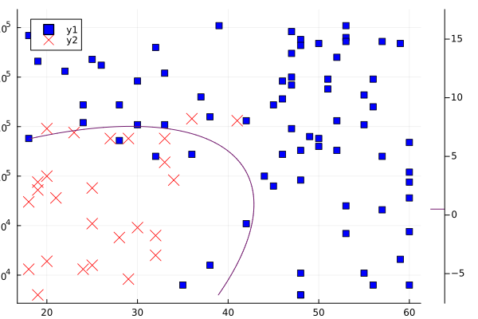

@def title = "NLPModelsIpopt.jl tutorial"
@def showall = true
@def tags = ["solvers", "ipopt"]

\preamble{Abel S. Siqueira}


[](https://juliasmoothoptimizers.github.io/NLPModels.jl/stable/)
[](https://juliasmoothoptimizers.github.io/NLPModelsIpopt.jl/stable/)


[](https://juliasmoothoptimizers.github.io/ADNLPModels.jl/stable/)


NLPModelsIpopt is a thin IPOPT wrapper for NLPModels. In this tutorial we show examples of problems created with NLPModels and solved with Ipopt.

## Simple problems

Let's create an NLPModel for the Rosenbrock function
$$
f(x) = (x_1 - 1)^2 + 100 (x_2 - x_1^2)^2
$$
and solve it with Ipopt:
```julia
using ADNLPModels, NLPModels, NLPModelsIpopt

nlp = ADNLPModel(x -> (x[1] - 1)^2 + 100 * (x[2] - x[1]^2)^2, [-1.2; 1.0])
stats = ipopt(nlp)
print(stats)
```

```plaintext
******************************************************************************
This program contains Ipopt, a library for large-scale nonlinear optimization.
 Ipopt is released as open source code under the Eclipse Public License (EPL).
         For more information visit https://github.com/coin-or/Ipopt
******************************************************************************

This is Ipopt version 3.14.4, running with linear solver MUMPS 5.4.1.

Number of nonzeros in equality constraint Jacobian...:        0
Number of nonzeros in inequality constraint Jacobian.:        0
Number of nonzeros in Lagrangian Hessian.............:        3

Total number of variables............................:        2
                     variables with only lower bounds:        0
                variables with lower and upper bounds:        0
                     variables with only upper bounds:        0
Total number of equality constraints.................:        0
Total number of inequality constraints...............:        0
        inequality constraints with only lower bounds:        0
   inequality constraints with lower and upper bounds:        0
        inequality constraints with only upper bounds:        0

iter    objective    inf_pr   inf_du lg(mu)  ||d||  lg(rg) alpha_du alpha_pr  ls
   0  2.4200000e+01 0.00e+00 1.00e+02  -1.0 0.00e+00    -  0.00e+00 0.00e+00   0
   1  4.7318843e+00 0.00e+00 2.15e+00  -1.0 3.81e-01    -  1.00e+00 1.00e+00f  1
   2  4.0873987e+00 0.00e+00 1.20e+01  -1.0 4.56e+00    -  1.00e+00 1.25e-01f  4
   3  3.2286726e+00 0.00e+00 4.94e+00  -1.0 2.21e-01    -  1.00e+00 1.00e+00f  1
   4  3.2138981e+00 0.00e+00 1.02e+01  -1.0 4.82e-01    -  1.00e+00 1.00e+00f  1
   5  1.9425854e+00 0.00e+00 1.62e+00  -1.0 6.70e-02    -  1.00e+00 1.00e+00f  1
   6  1.6001937e+00 0.00e+00 3.44e+00  -1.0 7.35e-01    -  1.00e+00 2.50e-01f  3
   7  1.1783896e+00 0.00e+00 1.92e+00  -1.0 1.44e-01    -  1.00e+00 1.00e+00f  1
   8  9.2241158e-01 0.00e+00 4.00e+00  -1.0 2.08e-01    -  1.00e+00 1.00e+00f  1
   9  5.9748862e-01 0.00e+00 7.36e-01  -1.0 8.91e-02    -  1.00e+00 1.00e+00f  1
iter    objective    inf_pr   inf_du lg(mu)  ||d||  lg(rg) alpha_du alpha_pr  ls
  10  4.5262510e-01 0.00e+00 2.42e+00  -1.7 2.97e-01    -  1.00e+00 5.00e-01f  2
  11  2.8076244e-01 0.00e+00 9.25e-01  -1.7 1.02e-01    -  1.00e+00 1.00e+00f  1
  12  2.1139340e-01 0.00e+00 3.34e+00  -1.7 1.77e-01    -  1.00e+00 1.00e+00f  1
  13  8.9019501e-02 0.00e+00 2.25e-01  -1.7 9.45e-02    -  1.00e+00 1.00e+00f  1
  14  5.1535405e-02 0.00e+00 1.49e+00  -1.7 2.84e-01    -  1.00e+00 5.00e-01f  2
  15  1.9992778e-02 0.00e+00 4.64e-01  -1.7 1.09e-01    -  1.00e+00 1.00e+00f  1
  16  7.1692436e-03 0.00e+00 1.03e+00  -1.7 1.39e-01    -  1.00e+00 1.00e+00f  1
  17  1.0696137e-03 0.00e+00 9.09e-02  -1.7 5.50e-02    -  1.00e+00 1.00e+00f  1
  18  7.7768464e-05 0.00e+00 1.44e-01  -2.5 5.53e-02    -  1.00e+00 1.00e+00f  1
  19  2.8246695e-07 0.00e+00 1.50e-03  -2.5 7.31e-03    -  1.00e+00 1.00e+00f  1
iter    objective    inf_pr   inf_du lg(mu)  ||d||  lg(rg) alpha_du alpha_pr  ls
  20  8.5170750e-12 0.00e+00 4.90e-05  -5.7 1.05e-03    -  1.00e+00 1.00e+00f  1
  21  3.7439756e-21 0.00e+00 1.73e-10  -5.7 2.49e-06    -  1.00e+00 1.00e+00f  1

Number of Iterations....: 21

                                   (scaled)                 (unscaled)
Objective...............:   1.7365378678754519e-21    3.7439756431394737e-21
Dual infeasibility......:   1.7312156654298279e-10    3.7325009746667082e-10
Constraint violation....:   0.0000000000000000e+00    0.0000000000000000e+00
Variable bound violation:   0.0000000000000000e+00    0.0000000000000000e+00
Complementarity.........:   0.0000000000000000e+00    0.0000000000000000e+00
Overall NLP error.......:   1.7312156654298279e-10    3.7325009746667082e-10


Number of objective function evaluations             = 45
Number of objective gradient evaluations             = 22
Number of equality constraint evaluations            = 0
Number of inequality constraint evaluations          = 0
Number of equality constraint Jacobian evaluations   = 0
Number of inequality constraint Jacobian evaluations = 0
Number of Lagrangian Hessian evaluations             = 21
Total seconds in IPOPT                               = 6.694

EXIT: Optimal Solution Found.
Generic Execution stats
  status: first-order stationary
  objective value: 3.743975643139474e-21
  primal feasibility: 0.0
  dual feasibility: 3.732500974666708e-10
  solution: [0.9999999999400667  0.9999999998789006]
  iterations: 21
  elapsed time: 6.694
  solver specific:
    real_time: 6.695076942443848
    internal_msg: :Solve_Succeeded
```


For comparison, we present the same problem and output using JuMP:
```julia
using JuMP, Ipopt

model = Model(Ipopt.Optimizer)
x0 = [-1.2; 1.0]
@variable(model, x[i=1:2], start=x0[i])
@NLobjective(model, Min, (x[1] - 1)^2 + 100 * (x[2] - x[1]^2)^2)
optimize!(model)
```

```plaintext
This is Ipopt version 3.14.4, running with linear solver MUMPS 5.4.1.

Number of nonzeros in equality constraint Jacobian...:        0
Number of nonzeros in inequality constraint Jacobian.:        0
Number of nonzeros in Lagrangian Hessian.............:        3

Total number of variables............................:        2
                     variables with only lower bounds:        0
                variables with lower and upper bounds:        0
                     variables with only upper bounds:        0
Total number of equality constraints.................:        0
Total number of inequality constraints...............:        0
        inequality constraints with only lower bounds:        0
   inequality constraints with lower and upper bounds:        0
        inequality constraints with only upper bounds:        0

iter    objective    inf_pr   inf_du lg(mu)  ||d||  lg(rg) alpha_du alpha_pr  ls
   0  2.4200000e+01 0.00e+00 1.00e+02  -1.0 0.00e+00    -  0.00e+00 0.00e+00   0
   1  4.7318843e+00 0.00e+00 2.15e+00  -1.0 3.81e-01    -  1.00e+00 1.00e+00f  1
   2  4.0873987e+00 0.00e+00 1.20e+01  -1.0 4.56e+00    -  1.00e+00 1.25e-01f  4
   3  3.2286726e+00 0.00e+00 4.94e+00  -1.0 2.21e-01    -  1.00e+00 1.00e+00f  1
   4  3.2138981e+00 0.00e+00 1.02e+01  -1.0 4.82e-01    -  1.00e+00 1.00e+00f  1
   5  1.9425854e+00 0.00e+00 1.62e+00  -1.0 6.70e-02    -  1.00e+00 1.00e+00f  1
   6  1.6001937e+00 0.00e+00 3.44e+00  -1.0 7.35e-01    -  1.00e+00 2.50e-01f  3
   7  1.1783896e+00 0.00e+00 1.92e+00  -1.0 1.44e-01    -  1.00e+00 1.00e+00f  1
   8  9.2241158e-01 0.00e+00 4.00e+00  -1.0 2.08e-01    -  1.00e+00 1.00e+00f  1
   9  5.9748862e-01 0.00e+00 7.36e-01  -1.0 8.91e-02    -  1.00e+00 1.00e+00f  1
iter    objective    inf_pr   inf_du lg(mu)  ||d||  lg(rg) alpha_du alpha_pr  ls
  10  4.5262510e-01 0.00e+00 2.42e+00  -1.7 2.97e-01    -  1.00e+00 5.00e-01f  2
  11  2.8076244e-01 0.00e+00 9.25e-01  -1.7 1.02e-01    -  1.00e+00 1.00e+00f  1
  12  2.1139340e-01 0.00e+00 3.34e+00  -1.7 1.77e-01    -  1.00e+00 1.00e+00f  1
  13  8.9019501e-02 0.00e+00 2.25e-01  -1.7 9.45e-02    -  1.00e+00 1.00e+00f  1
  14  5.1535405e-02 0.00e+00 1.49e+00  -1.7 2.84e-01    -  1.00e+00 5.00e-01f  2
  15  1.9992778e-02 0.00e+00 4.64e-01  -1.7 1.09e-01    -  1.00e+00 1.00e+00f  1
  16  7.1692436e-03 0.00e+00 1.03e+00  -1.7 1.39e-01    -  1.00e+00 1.00e+00f  1
  17  1.0696137e-03 0.00e+00 9.09e-02  -1.7 5.50e-02    -  1.00e+00 1.00e+00f  1
  18  7.7768464e-05 0.00e+00 1.44e-01  -2.5 5.53e-02    -  1.00e+00 1.00e+00f  1
  19  2.8246695e-07 0.00e+00 1.50e-03  -2.5 7.31e-03    -  1.00e+00 1.00e+00f  1
iter    objective    inf_pr   inf_du lg(mu)  ||d||  lg(rg) alpha_du alpha_pr  ls
  20  8.5170750e-12 0.00e+00 4.90e-05  -5.7 1.05e-03    -  1.00e+00 1.00e+00f  1
  21  3.7439756e-21 0.00e+00 1.73e-10  -5.7 2.49e-06    -  1.00e+00 1.00e+00f  1

Number of Iterations....: 21

                                   (scaled)                 (unscaled)
Objective...............:   1.7365378678754519e-21    3.7439756431394737e-21
Dual infeasibility......:   1.7312156654298279e-10    3.7325009746667082e-10
Constraint violation....:   0.0000000000000000e+00    0.0000000000000000e+00
Variable bound violation:   0.0000000000000000e+00    0.0000000000000000e+00
Complementarity.........:   0.0000000000000000e+00    0.0000000000000000e+00
Overall NLP error.......:   1.7312156654298279e-10    3.7325009746667082e-10


Number of objective function evaluations             = 45
Number of objective gradient evaluations             = 22
Number of equality constraint evaluations            = 0
Number of inequality constraint evaluations          = 0
Number of equality constraint Jacobian evaluations   = 0
Number of inequality constraint Jacobian evaluations = 0
Number of Lagrangian Hessian evaluations             = 21
Total seconds in IPOPT                               = 2.682

EXIT: Optimal Solution Found.
```


Here is an example with a constrained problem:
```julia
n = 10
x0 = ones(n)
x0[1:2:end] .= -1.2
lcon = ucon = zeros(n-2)
nlp = ADNLPModel(x -> sum((x[i] - 1)^2 + 100 * (x[i+1] - x[i]^2)^2 for i = 1:n-1), x0,
                 x -> [3 * x[k+1]^3 + 2 * x[k+2] - 5 + sin(x[k+1] - x[k+2]) * sin(x[k+1] + x[k+2]) +
                       4 * x[k+1] - x[k] * exp(x[k] - x[k+1]) - 3 for k = 1:n-2],
                 lcon, ucon)
stats = ipopt(nlp, print_level=0)
print(stats)
```

```plaintext
Generic Execution stats
  status: first-order stationary
  objective value: 6.232458632437464
  primal feasibility: 8.354650304909228e-12
  dual feasibility: 6.315958864770851e-9
  solution: [-0.9505563573613093  0.9139008176388945  0.9890905176644905  0.9985592422681151 ⋯ 0.999999930070643]
  multipliers: [4.1358568305002255  -1.876494903703342  -0.06556333356358673  -0.021931863018312882 ⋯ -7.376592164341867e-6]
  iterations: 6
  elapsed time: 6.568
  solver specific:
    real_time: 6.568714141845703
    internal_msg: :Solve_Succeeded
```


## Return value

The return value of `ipopt` is a `GenericExecutionStats` instance from `SolverCore`. It contains basic information on the solution returned by the solver.
In addition to the built-in fields of `GenericExecutionStats`, we store the detailed Ipopt output message inside `solver_specific[:internal_msg]`.

Here is an example using the constrained problem solve:
```julia
stats.solver_specific[:internal_msg]
```

```plaintext
:Solve_Succeeded
```


## Manual input

In this section, we work through an example where we specify the problem and its derivatives manually. For this, we need to implement the following `NLPModel` API methods:
- `obj(nlp, x)`: evaluate the objective value at `x`;
- `grad!(nlp, x, g)`: evaluate the objective gradient at `x`;
- `cons!(nlp, x, c)`: evaluate the vector of constraints, if any;
- `jac_structure!(nlp, rows, cols)`: fill `rows` and `cols` with the spartity structure of the Jacobian, if the problem is constrained;
- `jac_coord!(nlp, x, vals)`: fill `vals` with the Jacobian values corresponding to the sparsity structure returned by `jac_structure!()`;
- `hess_structure!(nlp, rows, cols)`: fill `rows` and `cols` with the spartity structure of the lower triangle of the Hessian of the Lagrangian;
- `hess_coord!(nlp, x, y, vals; obj_weight=1.0)`: fill `vals` with the values of the Hessian of the Lagrangian corresponding to the sparsity structure returned by `hess_structure!()`, where `obj_weight` is the weight assigned to the objective, and `y` is the vector of multipliers.

The model that we implement is a logistic regression model. We consider the model $h(\beta; x) = (1 + e^{-\beta^Tx})^{-1}$, and the loss function
$$
\ell(\beta) = -\sum_{i = 1}^m y_i \ln h(\beta; x_i) + (1 - y_i) \ln(1 - h(\beta; x_i))
$$
with regularization $\lambda \|\beta\|^2 / 2$.

```julia
using DataFrames, LinearAlgebra, NLPModels, NLPModelsIpopt, Random

mutable struct LogisticRegression <: AbstractNLPModel{Float64, Vector{Float64}}
  X :: Matrix{Float64}
  y :: Vector{Float64}
  λ :: Float64
  meta :: NLPModelMeta{Float64, Vector{Float64}} # required by AbstractNLPModel
  counters :: Counters # required by AbstractNLPModel
end

function LogisticRegression(X, y, λ = 0.0)
  m, n = size(X)
  meta = NLPModelMeta(n, name="LogisticRegression", nnzh=div(n * (n+1), 2) + n) # nnzh is the length of the coordinates vectors
  return LogisticRegression(X, y, λ, meta, Counters())
end

function NLPModels.obj(nlp :: LogisticRegression, β::AbstractVector)
  hβ = 1 ./ (1 .+ exp.(-nlp.X * β))
  return -sum(nlp.y .* log.(hβ .+ 1e-8) .+ (1 .- nlp.y) .* log.(1 .- hβ .+ 1e-8)) + nlp.λ * dot(β, β) / 2
end

function NLPModels.grad!(nlp :: LogisticRegression, β::AbstractVector, g::AbstractVector)
  hβ = 1 ./ (1 .+ exp.(-nlp.X * β))
  g .= nlp.X' * (hβ .- nlp.y) + nlp.λ * β
end

function NLPModels.hess_structure!(nlp :: LogisticRegression, rows :: AbstractVector{<:Integer}, cols :: AbstractVector{<:Integer})
  n = nlp.meta.nvar
  I = ((i,j) for i = 1:n, j = 1:n if i ≥ j)
  rows[1 : nlp.meta.nnzh] .= [getindex.(I, 1); 1:n]
  cols[1 : nlp.meta.nnzh] .= [getindex.(I, 2); 1:n]
  return rows, cols
end

function NLPModels.hess_coord!(nlp :: LogisticRegression, β::AbstractVector, vals::AbstractVector; obj_weight=1.0, y=Float64[])
  n, m = nlp.meta.nvar, length(nlp.y)
  hβ = 1 ./ (1 .+ exp.(-nlp.X * β))
  fill!(vals, 0.0)
  for k = 1:m
    hk = hβ[k]
    p = 1
    for j = 1:n, i = j:n
      vals[p] += obj_weight * hk * (1 - hk) * nlp.X[k,i] * nlp.X[k,j]
      p += 1
    end
  end
  vals[nlp.meta.nnzh+1:end] .= nlp.λ * obj_weight
  return vals
end

Random.seed!(0)

# Training set
m = 1000
df = DataFrame(:age => rand(18:60, m), :salary => rand(40:180, m) * 1000)
df.buy = (df.age .> 40 .+ randn(m) * 5) .| (df.salary .> 120_000 .+ randn(m) * 10_000)

X = [ones(m) df.age df.age.^2 df.salary df.salary.^2 df.age .* df.salary]
y = df.buy

λ = 1.0e-2
nlp = LogisticRegression(X, y, λ)
stats = ipopt(nlp, print_level=0)
β = stats.solution

# Test set - same generation method
m = 100
df = DataFrame(:age => rand(18:60, m), :salary => rand(40:180, m) * 1000)
df.buy = (df.age .> 40 .+ randn(m) * 5) .| (df.salary .> 120_000 .+ randn(m) * 10_000)

X = [ones(m) df.age df.age.^2 df.salary df.salary.^2 df.age .* df.salary]
hβ = 1 ./ (1 .+ exp.(-X * β))
ypred = hβ .> 0.5

acc = count(df.buy .== ypred) / m
println("acc = $acc")
```

```plaintext
acc = 0.91
```


```julia
using Plots
gr()


f(a, b) = dot(β, [1.0; a; a^2; b; b^2; a * b])
P = findall(df.buy .== true)
scatter(df.age[P], df.salary[P], c=:blue, m=:square)
P = findall(df.buy .== false)
scatter!(df.age[P], df.salary[P], c=:red, m=:xcross, ms=7)
contour!(range(18, 60, step=0.1), range(40_000, 180_000, step=1.0), f, levels=[0.5])
```


