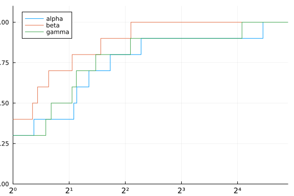
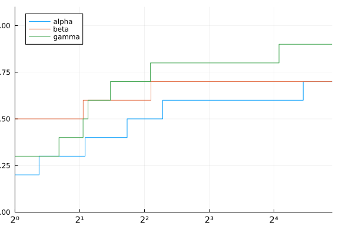
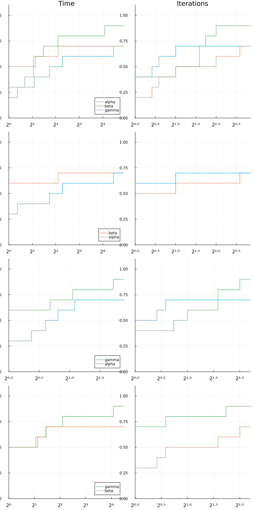

@def title = "SolverBenchmark.jl tutorial"
@def showall = true
@def tags = ["solver", "benchmark", "profile", "latex"]

\preamble{Abel S. Siqueira and Dominique Orban}


[](https://jso.dev/SolverBenchmark.jl/stable/)


In this tutorial we illustrate the main uses of `SolverBenchmark`.

First, let's create fake data. It is imperative that the data for each solver be stored
in `DataFrame`s, and the collection of different solver must be stored in a dictionary of
`Symbol` to `DataFrame`.

In our examples we'll use the following data.

```julia
using DataFrames, Printf, Random

Random.seed!(0)

n = 10
names = [:alpha, :beta, :gamma]
stats = Dict(name => DataFrame(:id => 1:n,
         :name => [@sprintf("prob%03d", i) for i = 1:n],
         :status => map(x -> x < 0.75 ? :first_order : :failure, rand(n)),
         :f => randn(n),
         :t => 1e-3 .+ rand(n) * 1000,
         :iter => rand(10:10:100, n),
         :irrelevant => randn(n)) for name in names)
```

```plaintext
Dict{Symbol, DataFrames.DataFrame} with 3 entries:
  :alpha => 10×7 DataFrame…
  :beta  => 10×7 DataFrame…
  :gamma => 10×7 DataFrame…
```


The data consists of a (fake) run of three solvers `alpha`, `beta` and `gamma`.
Each solver has a column `id`, which is necessary for joining the solvers (names
can be repeated), and columns `name`, `status`, `f`, `t` and `iter` corresponding to
problem results. There is also a column `irrelevant` with extra information that will
not be used to produce our benchmarks.

Here are the statistics of solver `alpha`:

```julia
stats[:alpha]
```

```plaintext
10×7 DataFrame
 Row │ id     name     status       f           t        iter   irrelevant
     │ Int64  String   Symbol       Float64     Float64  Int64  Float64
─────┼─────────────────────────────────────────────────────────────────────
   1 │     1  prob001  first_order  -0.0242466  677.623     60  -1.15534
   2 │     2  prob002  first_order  -0.384201   645.643     90  -1.35454
   3 │     3  prob003  failure       0.578679   634.037     50  -0.117157
   4 │     4  prob004  failure       1.46765    559.585     70   1.15241
   5 │     5  prob005  first_order  -1.76643    567.557     10  -0.0381476
   6 │     6  prob006  first_order   0.608755   343.518     20  -1.00298
   7 │     7  prob007  first_order  -0.140199   426.141     10  -0.79729
   8 │     8  prob008  failure       0.835692   621.998     20   0.744854
   9 │     9  prob009  first_order  -0.929152   148.249     40   0.795775
  10 │    10  prob010  first_order   0.0788921  230.955     30  -0.839227
```


## Tables

The first thing we may want to do is produce a table for each solver. Notice that the
solver result is already a DataFrame, so there are a few options available in other
packages, as well as simply printing the DataFrame.
Our concern here is two-fold: producing publication-ready LaTeX tables, and web-ready
markdown tables.

The simplest use is `pretty_stats(io, dataframe)`.
By default, `io` is `stdout`:

```julia
using SolverBenchmark

pretty_stats(stats[:alpha])
```

```plaintext
┌────────┬─────────┬─────────────┬───────────┬───────────┬────────┬────────────┐
│     id │    name │      status │         f │         t │   iter │ irrelevant │
├────────┼─────────┼─────────────┼───────────┼───────────┼────────┼────────────┤
│      1 │ prob001 │ first_order │ -2.42e-02 │  6.78e+02 │     60 │  -1.16e+00 │
│      2 │ prob002 │ first_order │ -3.84e-01 │  6.46e+02 │     90 │  -1.35e+00 │
│      3 │ prob003 │     failure │  5.79e-01 │  6.34e+02 │     50 │  -1.17e-01 │
│      4 │ prob004 │     failure │  1.47e+00 │  5.60e+02 │     70 │   1.15e+00 │
│      5 │ prob005 │ first_order │ -1.77e+00 │  5.68e+02 │     10 │  -3.81e-02 │
│      6 │ prob006 │ first_order │  6.09e-01 │  3.44e+02 │     20 │  -1.00e+00 │
│      7 │ prob007 │ first_order │ -1.40e-01 │  4.26e+02 │     10 │  -7.97e-01 │
│      8 │ prob008 │     failure │  8.36e-01 │  6.22e+02 │     20 │   7.45e-01 │
│      9 │ prob009 │ first_order │ -9.29e-01 │  1.48e+02 │     40 │   7.96e-01 │
│     10 │ prob010 │ first_order │  7.89e-02 │  2.31e+02 │     30 │  -8.39e-01 │
└────────┴─────────┴─────────────┴───────────┴───────────┴────────┴────────────┘
```


Printing is LaTeX format is achieved with `pretty_latex_stats`:

```julia
pretty_latex_stats(stats[:alpha])
```

```plaintext
\begin{longtable}{rrrrrrr}
  \hline
  id & name & status & f & t & iter & irrelevant \\\hline
  \endfirsthead
  \hline
  id & name & status & f & t & iter & irrelevant \\\hline
  \endhead
  \hline
  \multicolumn{7}{r}{{\bfseries Continued on next page}}\\
  \hline
  \endfoot
  \endlastfoot
  \(     1\) & prob001 & first\_order & \(-2.42\)e\(-02\) & \( 6.78\)e\(+02\) & \(    60\) & \(-1.16\)e\(+00\) \\
  \(     2\) & prob002 & first\_order & \(-3.84\)e\(-01\) & \( 6.46\)e\(+02\) & \(    90\) & \(-1.35\)e\(+00\) \\
  \(     3\) & prob003 & failure & \( 5.79\)e\(-01\) & \( 6.34\)e\(+02\) & \(    50\) & \(-1.17\)e\(-01\) \\
  \(     4\) & prob004 & failure & \( 1.47\)e\(+00\) & \( 5.60\)e\(+02\) & \(    70\) & \( 1.15\)e\(+00\) \\
  \(     5\) & prob005 & first\_order & \(-1.77\)e\(+00\) & \( 5.68\)e\(+02\) & \(    10\) & \(-3.81\)e\(-02\) \\
  \(     6\) & prob006 & first\_order & \( 6.09\)e\(-01\) & \( 3.44\)e\(+02\) & \(    20\) & \(-1.00\)e\(+00\) \\
  \(     7\) & prob007 & first\_order & \(-1.40\)e\(-01\) & \( 4.26\)e\(+02\) & \(    10\) & \(-7.97\)e\(-01\) \\
  \(     8\) & prob008 & failure & \( 8.36\)e\(-01\) & \( 6.22\)e\(+02\) & \(    20\) & \( 7.45\)e\(-01\) \\
  \(     9\) & prob009 & first\_order & \(-9.29\)e\(-01\) & \( 1.48\)e\(+02\) & \(    40\) & \( 7.96\)e\(-01\) \\
  \(    10\) & prob010 & first\_order & \( 7.89\)e\(-02\) & \( 2.31\)e\(+02\) & \(    30\) & \(-8.39\)e\(-01\) \\\hline
\end{longtable}
```


If only a subset of columns should be printed, the DataFrame should be indexed accordingly:

```julia
df = stats[:alpha]
pretty_stats(df[!, [:name, :f, :t]])
```

```plaintext
┌─────────┬───────────┬───────────┐
│    name │         f │         t │
├─────────┼───────────┼───────────┤
│ prob001 │ -2.42e-02 │  6.78e+02 │
│ prob002 │ -3.84e-01 │  6.46e+02 │
│ prob003 │  5.79e-01 │  6.34e+02 │
│ prob004 │  1.47e+00 │  5.60e+02 │
│ prob005 │ -1.77e+00 │  5.68e+02 │
│ prob006 │  6.09e-01 │  3.44e+02 │
│ prob007 │ -1.40e-01 │  4.26e+02 │
│ prob008 │  8.36e-01 │  6.22e+02 │
│ prob009 │ -9.29e-01 │  1.48e+02 │
│ prob010 │  7.89e-02 │  2.31e+02 │
└─────────┴───────────┴───────────┘
```


Markdown tables may be generated by supplying the PrettyTables `tf` keyword argument to specify the table format:

```julia
pretty_stats(df[!, [:name, :f, :t]], tf=tf_markdown)
```

```plaintext
|    name |         f |         t |
|---------|-----------|-----------|
| prob001 | -2.42e-02 |  6.78e+02 |
| prob002 | -3.84e-01 |  6.46e+02 |
| prob003 |  5.79e-01 |  6.34e+02 |
| prob004 |  1.47e+00 |  5.60e+02 |
| prob005 | -1.77e+00 |  5.68e+02 |
| prob006 |  6.09e-01 |  3.44e+02 |
| prob007 | -1.40e-01 |  4.26e+02 |
| prob008 |  8.36e-01 |  6.22e+02 |
| prob009 | -9.29e-01 |  1.48e+02 |
| prob010 |  7.89e-02 |  2.31e+02 |
```


All values of `tf` accepted by PrettyTables may be used in SolverBenchmark.

The `fmt_override` option overrides the formatting of a specific column.
The argument should be a dictionary of `Symbol` to format strings, where the format string will be applied to each element of the column.

The `hdr_override` changes the column headers.

```julia
fmt_override = Dict(:f => "%+10.3e",
                    :t => "%08.2f")
hdr_override = Dict(:name => "Name", :f => "f(x)", :t => "Time")
pretty_stats(stdout,
             df[!, [:name, :f, :t]],
             col_formatters = fmt_override,
             hdr_override = hdr_override)
```

```plaintext
┌─────────┬────────────┬──────────┐
│    Name │       f(x) │     Time │
├─────────┼────────────┼──────────┤
│ prob001 │ -2.425e-02 │ 00677.62 │
│ prob002 │ -3.842e-01 │ 00645.64 │
│ prob003 │ +5.787e-01 │ 00634.04 │
│ prob004 │ +1.468e+00 │ 00559.59 │
│ prob005 │ -1.766e+00 │ 00567.56 │
│ prob006 │ +6.088e-01 │ 00343.52 │
│ prob007 │ -1.402e-01 │ 00426.14 │
│ prob008 │ +8.357e-01 │ 00622.00 │
│ prob009 │ -9.292e-01 │ 00148.25 │
│ prob010 │ +7.889e-02 │ 00230.96 │
└─────────┴────────────┴──────────┘
```


While `col_formatters` is for simple format strings, the PrettyTables API lets us define more elaborate formatters in the form of functions:

```julia
fmt_override = Dict(:f => "%+10.3e",
                    :t => "%08.2f")
hdr_override = Dict(:name => "Name", :f => "f(x)", :t => "Time")
pretty_stats(df[!, [:name, :f, :t]],
             col_formatters = fmt_override,
             hdr_override = hdr_override,
             formatters = (v, i, j) -> begin
               if j == 3  # t is the 3rd column
                 vi = floor(Int, v)
                 minutes = div(vi, 60)
                 seconds = vi % 60
                 micros = round(Int, 1e6 * (v - vi))
                 @sprintf("%2dm %02ds %06dμs", minutes, seconds, micros)
               else
                 v
               end
             end)
```

```plaintext
┌─────────┬────────────┬──────────────────┐
│    Name │       f(x) │             Time │
├─────────┼────────────┼──────────────────┤
│ prob001 │ -2.425e-02 │ 11m 17s 623091μs │
│ prob002 │ -3.842e-01 │ 10m 45s 642602μs │
│ prob003 │ +5.787e-01 │ 10m 34s 037248μs │
│ prob004 │ +1.468e+00 │  9m 19s 585367μs │
│ prob005 │ -1.766e+00 │  9m 27s 556767μs │
│ prob006 │ +6.088e-01 │  5m 43s 518002μs │
│ prob007 │ -1.402e-01 │  7m 06s 141220μs │
│ prob008 │ +8.357e-01 │ 10m 21s 997591μs │
│ prob009 │ -9.292e-01 │  2m 28s 248989μs │
│ prob010 │ +7.889e-02 │  3m 50s 955096μs │
└─────────┴────────────┴──────────────────┘
```


See the [PrettyTables.jl documentation](https://ronisbr.github.io/PrettyTables.jl/stable/) for more information.

When using LaTeX format, the output must be understood by LaTeX.
By default, numerical data in the table is wrapped in inline math environments.
But those math environments would interfere with our formatting of the time.
Thus we must first disable them for the `time` column using `col_formatters`, and then apply the PrettyTables formatter as above:

```julia
fmt_override = Dict(:f => "%+10.3e",
                    :t => "%08.2f")
hdr_override = Dict(:name => "Name", :f => "f(x)", :t => "Time")
pretty_latex_stats(
df[!, [:name, :status, :f, :t, :iter]],
col_formatters = Dict(:t => "%f"),  # disable default formatting of t
formatters = (v,i,j) -> begin
  if j == 4
    xi = floor(Int, v)
    minutes = div(xi, 60)
    seconds = xi % 60
    micros = round(Int, 1e6 * (v - xi))
    @sprintf("\\(%2d\\)m \\(%02d\\)s \\(%06d \\mu\\)s", minutes, seconds, micros)
  else
    v
  end
end
)
```

```plaintext
\begin{longtable}{rrrrr}
  \hline
  name & status & f & t & iter \\\hline
  \endfirsthead
  \hline
  name & status & f & t & iter \\\hline
  \endhead
  \hline
  \multicolumn{5}{r}{{\bfseries Continued on next page}}\\
  \hline
  \endfoot
  \endlastfoot
  prob001 & first\_order & \(-2.42\)e\(-02\) & \(11\)m \(17\)s \(623091 \mu\)s & \(    60\) \\
  prob002 & first\_order & \(-3.84\)e\(-01\) & \(10\)m \(45\)s \(642602 \mu\)s & \(    90\) \\
  prob003 & failure & \( 5.79\)e\(-01\) & \(10\)m \(34\)s \(037248 \mu\)s & \(    50\) \\
  prob004 & failure & \( 1.47\)e\(+00\) & \( 9\)m \(19\)s \(585367 \mu\)s & \(    70\) \\
  prob005 & first\_order & \(-1.77\)e\(+00\) & \( 9\)m \(27\)s \(556767 \mu\)s & \(    10\) \\
  prob006 & first\_order & \( 6.09\)e\(-01\) & \( 5\)m \(43\)s \(518002 \mu\)s & \(    20\) \\
  prob007 & first\_order & \(-1.40\)e\(-01\) & \( 7\)m \(06\)s \(141220 \mu\)s & \(    10\) \\
  prob008 & failure & \( 8.36\)e\(-01\) & \(10\)m \(21\)s \(997591 \mu\)s & \(    20\) \\
  prob009 & first\_order & \(-9.29\)e\(-01\) & \( 2\)m \(28\)s \(248989 \mu\)s & \(    40\) \\
  prob010 & first\_order & \( 7.89\)e\(-02\) & \( 3\)m \(50\)s \(955096 \mu\)s & \(    30\) \\\hline
\end{longtable}
```


### Joining tables

In some occasions, instead of/in addition to showing individual results, we show
a table with the result of multiple solvers.

```julia
df = join(stats, [:f, :t])
pretty_stats(stdout, df)
```

```plaintext
┌────────┬───────────┬───────────┬───────────┬───────────┬───────────┬───────────┐
│     id │   f_alpha │   t_alpha │    f_beta │    t_beta │   f_gamma │   t_gamma │
├────────┼───────────┼───────────┼───────────┼───────────┼───────────┼───────────┤
│      1 │ -2.42e-02 │  6.78e+02 │  5.90e-01 │  3.10e+01 │ -7.31e-01 │  5.23e+02 │
│      2 │ -3.84e-01 │  6.46e+02 │ -9.15e-01 │  1.94e+02 │ -1.38e+00 │  4.25e+02 │
│      3 │  5.79e-01 │  6.34e+02 │ -2.14e+00 │  5.16e+02 │  1.90e+00 │  2.48e+02 │
│      4 │  1.47e+00 │  5.60e+02 │  4.86e-01 │  7.12e+02 │  4.77e-01 │  8.39e+02 │
│      5 │ -1.77e+00 │  5.68e+02 │ -3.67e-01 │  1.17e+02 │  3.74e-01 │  3.24e+02 │
│      6 │  6.09e-01 │  3.44e+02 │ -1.44e+00 │  4.79e+02 │  1.36e+00 │  1.62e+02 │
│      7 │ -1.40e-01 │  4.26e+02 │  1.23e-01 │  6.62e+02 │  8.25e-04 │  8.83e+02 │
│      8 │  8.36e-01 │  6.22e+02 │  2.63e-01 │  3.84e+02 │ -2.04e+00 │  2.83e+02 │
│      9 │ -9.29e-01 │  1.48e+02 │  1.41e+00 │  1.15e+02 │  8.89e-01 │  4.88e+02 │
│     10 │  7.89e-02 │  2.31e+02 │ -1.89e+00 │  9.90e+02 │ -3.92e-01 │  3.70e+02 │
└────────┴───────────┴───────────┴───────────┴───────────┴───────────┴───────────┘
```


The column `:id` is used as guide on where to join. In addition, we may have
repeated columns between the solvers. We convery that information with argument `invariant_cols`.

```julia
df = join(stats, [:f, :t], invariant_cols=[:name])
pretty_stats(stdout, df)
```

```plaintext
┌────────┬─────────┬───────────┬───────────┬───────────┬───────────┬───────────┬───────────┐
│     id │    name │   f_alpha │   t_alpha │    f_beta │    t_beta │   f_gamma │   t_gamma │
├────────┼─────────┼───────────┼───────────┼───────────┼───────────┼───────────┼───────────┤
│      1 │ prob001 │ -2.42e-02 │  6.78e+02 │  5.90e-01 │  3.10e+01 │ -7.31e-01 │  5.23e+02 │
│      2 │ prob002 │ -3.84e-01 │  6.46e+02 │ -9.15e-01 │  1.94e+02 │ -1.38e+00 │  4.25e+02 │
│      3 │ prob003 │  5.79e-01 │  6.34e+02 │ -2.14e+00 │  5.16e+02 │  1.90e+00 │  2.48e+02 │
│      4 │ prob004 │  1.47e+00 │  5.60e+02 │  4.86e-01 │  7.12e+02 │  4.77e-01 │  8.39e+02 │
│      5 │ prob005 │ -1.77e+00 │  5.68e+02 │ -3.67e-01 │  1.17e+02 │  3.74e-01 │  3.24e+02 │
│      6 │ prob006 │  6.09e-01 │  3.44e+02 │ -1.44e+00 │  4.79e+02 │  1.36e+00 │  1.62e+02 │
│      7 │ prob007 │ -1.40e-01 │  4.26e+02 │  1.23e-01 │  6.62e+02 │  8.25e-04 │  8.83e+02 │
│      8 │ prob008 │  8.36e-01 │  6.22e+02 │  2.63e-01 │  3.84e+02 │ -2.04e+00 │  2.83e+02 │
│      9 │ prob009 │ -9.29e-01 │  1.48e+02 │  1.41e+00 │  1.15e+02 │  8.89e-01 │  4.88e+02 │
│     10 │ prob010 │  7.89e-02 │  2.31e+02 │ -1.89e+00 │  9.90e+02 │ -3.92e-01 │  3.70e+02 │
└────────┴─────────┴───────────┴───────────┴───────────┴───────────┴───────────┴───────────┘
```


`join` also accepts `hdr_override` for changing the column name before appending
`_solver`.

```julia
hdr_override = Dict(:name => "Name", :f => "f(x)", :t => "Time")
df = join(stats, [:f, :t], invariant_cols=[:name], hdr_override=hdr_override)
pretty_stats(stdout, df)
```

```plaintext
┌────────┬─────────┬────────────┬────────────┬───────────┬───────────┬────────────┬────────────┐
│     id │    name │ f(x)_alpha │ Time_alpha │ f(x)_beta │ Time_beta │ f(x)_gamma │ Time_gamma │
├────────┼─────────┼────────────┼────────────┼───────────┼───────────┼────────────┼────────────┤
│      1 │ prob001 │  -2.42e-02 │   6.78e+02 │  5.90e-01 │  3.10e+01 │  -7.31e-01 │   5.23e+02 │
│      2 │ prob002 │  -3.84e-01 │   6.46e+02 │ -9.15e-01 │  1.94e+02 │  -1.38e+00 │   4.25e+02 │
│      3 │ prob003 │   5.79e-01 │   6.34e+02 │ -2.14e+00 │  5.16e+02 │   1.90e+00 │   2.48e+02 │
│      4 │ prob004 │   1.47e+00 │   5.60e+02 │  4.86e-01 │  7.12e+02 │   4.77e-01 │   8.39e+02 │
│      5 │ prob005 │  -1.77e+00 │   5.68e+02 │ -3.67e-01 │  1.17e+02 │   3.74e-01 │   3.24e+02 │
│      6 │ prob006 │   6.09e-01 │   3.44e+02 │ -1.44e+00 │  4.79e+02 │   1.36e+00 │   1.62e+02 │
│      7 │ prob007 │  -1.40e-01 │   4.26e+02 │  1.23e-01 │  6.62e+02 │   8.25e-04 │   8.83e+02 │
│      8 │ prob008 │   8.36e-01 │   6.22e+02 │  2.63e-01 │  3.84e+02 │  -2.04e+00 │   2.83e+02 │
│      9 │ prob009 │  -9.29e-01 │   1.48e+02 │  1.41e+00 │  1.15e+02 │   8.89e-01 │   4.88e+02 │
│     10 │ prob010 │   7.89e-02 │   2.31e+02 │ -1.89e+00 │  9.90e+02 │  -3.92e-01 │   3.70e+02 │
└────────┴─────────┴────────────┴────────────┴───────────┴───────────┴────────────┴────────────┘
```


```julia
hdr_override = Dict(:name => "Name", :f => "\\(f(x)\\)", :t => "Time")
df = join(stats, [:f, :t], invariant_cols=[:name], hdr_override=hdr_override)
pretty_latex_stats(df)
```

```plaintext
\begin{longtable}{rrrrrrrr}
  \hline
  id & name & \(f(x)\)\_alpha & Time\_alpha & \(f(x)\)\_beta & Time\_beta & \(f(x)\)\_gamma & Time\_gamma \\\hline
  \endfirsthead
  \hline
  id & name & \(f(x)\)\_alpha & Time\_alpha & \(f(x)\)\_beta & Time\_beta & \(f(x)\)\_gamma & Time\_gamma \\\hline
  \endhead
  \hline
  \multicolumn{8}{r}{{\bfseries Continued on next page}}\\
  \hline
  \endfoot
  \endlastfoot
  \(     1\) & prob001 & \(-2.42\)e\(-02\) & \( 6.78\)e\(+02\) & \( 5.90\)e\(-01\) & \( 3.10\)e\(+01\) & \(-7.31\)e\(-01\) & \( 5.23\)e\(+02\) \\
  \(     2\) & prob002 & \(-3.84\)e\(-01\) & \( 6.46\)e\(+02\) & \(-9.15\)e\(-01\) & \( 1.94\)e\(+02\) & \(-1.38\)e\(+00\) & \( 4.25\)e\(+02\) \\
  \(     3\) & prob003 & \( 5.79\)e\(-01\) & \( 6.34\)e\(+02\) & \(-2.14\)e\(+00\) & \( 5.16\)e\(+02\) & \( 1.90\)e\(+00\) & \( 2.48\)e\(+02\) \\
  \(     4\) & prob004 & \( 1.47\)e\(+00\) & \( 5.60\)e\(+02\) & \( 4.86\)e\(-01\) & \( 7.12\)e\(+02\) & \( 4.77\)e\(-01\) & \( 8.39\)e\(+02\) \\
  \(     5\) & prob005 & \(-1.77\)e\(+00\) & \( 5.68\)e\(+02\) & \(-3.67\)e\(-01\) & \( 1.17\)e\(+02\) & \( 3.74\)e\(-01\) & \( 3.24\)e\(+02\) \\
  \(     6\) & prob006 & \( 6.09\)e\(-01\) & \( 3.44\)e\(+02\) & \(-1.44\)e\(+00\) & \( 4.79\)e\(+02\) & \( 1.36\)e\(+00\) & \( 1.62\)e\(+02\) \\
  \(     7\) & prob007 & \(-1.40\)e\(-01\) & \( 4.26\)e\(+02\) & \( 1.23\)e\(-01\) & \( 6.62\)e\(+02\) & \( 8.25\)e\(-04\) & \( 8.83\)e\(+02\) \\
  \(     8\) & prob008 & \( 8.36\)e\(-01\) & \( 6.22\)e\(+02\) & \( 2.63\)e\(-01\) & \( 3.84\)e\(+02\) & \(-2.04\)e\(+00\) & \( 2.83\)e\(+02\) \\
  \(     9\) & prob009 & \(-9.29\)e\(-01\) & \( 1.48\)e\(+02\) & \( 1.41\)e\(+00\) & \( 1.15\)e\(+02\) & \( 8.89\)e\(-01\) & \( 4.88\)e\(+02\) \\
  \(    10\) & prob010 & \( 7.89\)e\(-02\) & \( 2.31\)e\(+02\) & \(-1.89\)e\(+00\) & \( 9.90\)e\(+02\) & \(-3.92\)e\(-01\) & \( 3.70\)e\(+02\) \\\hline
\end{longtable}
```


## Profiles

Performance profiles are a comparison tool developed by [Dolan and
Moré, 2002](https://link.springer.com/article/10.1007/s101070100263/) that takes into
account the relative performance of a solver and whether it has achieved convergence for each
problem. `SolverBenchmark.jl` uses
[BenchmarkProfiles.jl](https://github.com/JuliaSmoothOptimizers/BenchmarkProfiles.jl)
for generating performance profiles from the dictionary of `DataFrame`s.

The basic usage is `performance_profile(stats, cost)`, where `cost` is a function
applied to a `DataFrame` and returning a vector.

```julia
using Plots

p = performance_profile(stats, df -> df.t)
```




Notice that we used `df -> df.t` which corresponds to the column `:t` of the
`DataFrame`s.
This does not take into account that the solvers have failed for a few problems
(according to column :status). The next profile takes that into account.

```julia
cost(df) = (df.status .!= :first_order) * Inf + df.t
p = performance_profile(stats, cost)
```




### Profile wall

Another profile function is `profile_solvers`, which creates a wall of performance
profiles, accepting multiple costs and doing 1 vs 1 comparisons in addition to the
traditional performance profile.

```julia
solved(df) = (df.status .== :first_order)
costs = [df -> .!solved(df) * Inf + df.t, df -> .!solved(df) * Inf + df.iter]
costnames = ["Time", "Iterations"]
p = profile_solvers(stats, costs, costnames)
```




### Example of benchmark running
Here is a useful tutorial on how to use the benchmark with specific solver:
[Run a benchmark with OptimizationProblems](https://jso.dev/OptimizationProblems.jl/dev/benchmark/)
The tutorial covers how to use the problems from `OptimizationProblems` to run a benchmark for unconstrained optimization.
