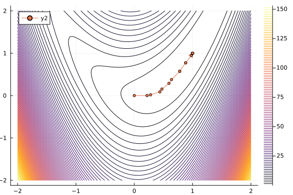
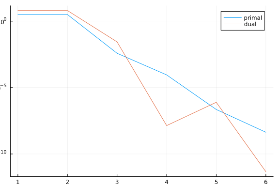

@def title = "Using callbacks"
@def showall = true
@def tags = ["solvers", "callback", "percival"]

\preamble{Abel S. Siqueira}


One useful feature of our optimization solvers is the option to add a **callback**, i.e., a function that is called during the execution of the method, between iterations.
It can be used for adding more logging information, for instance to plot the trace of the algorithm, or for having more control over the progress of the method, for instance by adding additional stopping criteria.

---

For these examples, let's consider a simple extension of the Rosenbrock function:

$$\min\ \sum_{i=1}^N (x_{2i-1} - 1)^2 + (2i)^2 (x_{2i} - x_{2i-1}^2)^2$$

We will implement this in `JuMP` and use `NLPModelsJuMP` to bridge the model to our NLPModels format.

```julia
using JuMP, NLPModelsJuMP

model = Model()
N = 10
@variable(model, x[1:2N])
@NLobjective(model, Min,
  sum((x[2i - 1] - 1)^2 + (2i)^2 * (x[2i] - x[2i-1]^2)^2 for i = 1:N)
)

nlp = MathOptNLPModel(model)
```

```plaintext
NLPModelsJuMP.MathOptNLPModel
  Problem name: Generic
   All variables: ████████████████████ 20     All constraints: ⋅⋅⋅⋅⋅⋅⋅⋅⋅⋅⋅⋅⋅⋅⋅⋅⋅⋅⋅⋅ 0     
            free: ████████████████████ 20                free: ⋅⋅⋅⋅⋅⋅⋅⋅⋅⋅⋅⋅⋅⋅⋅⋅⋅⋅⋅⋅ 0     
           lower: ⋅⋅⋅⋅⋅⋅⋅⋅⋅⋅⋅⋅⋅⋅⋅⋅⋅⋅⋅⋅ 0                lower: ⋅⋅⋅⋅⋅⋅⋅⋅⋅⋅⋅⋅⋅⋅⋅⋅⋅⋅⋅⋅ 0     
           upper: ⋅⋅⋅⋅⋅⋅⋅⋅⋅⋅⋅⋅⋅⋅⋅⋅⋅⋅⋅⋅ 0                upper: ⋅⋅⋅⋅⋅⋅⋅⋅⋅⋅⋅⋅⋅⋅⋅⋅⋅⋅⋅⋅ 0     
         low/upp: ⋅⋅⋅⋅⋅⋅⋅⋅⋅⋅⋅⋅⋅⋅⋅⋅⋅⋅⋅⋅ 0              low/upp: ⋅⋅⋅⋅⋅⋅⋅⋅⋅⋅⋅⋅⋅⋅⋅⋅⋅⋅⋅⋅ 0     
           fixed: ⋅⋅⋅⋅⋅⋅⋅⋅⋅⋅⋅⋅⋅⋅⋅⋅⋅⋅⋅⋅ 0                fixed: ⋅⋅⋅⋅⋅⋅⋅⋅⋅⋅⋅⋅⋅⋅⋅⋅⋅⋅⋅⋅ 0     
          infeas: ⋅⋅⋅⋅⋅⋅⋅⋅⋅⋅⋅⋅⋅⋅⋅⋅⋅⋅⋅⋅ 0               infeas: ⋅⋅⋅⋅⋅⋅⋅⋅⋅⋅⋅⋅⋅⋅⋅⋅⋅⋅⋅⋅ 0     
            nnzh: ( 85.71% sparsity)   30              linear: ⋅⋅⋅⋅⋅⋅⋅⋅⋅⋅⋅⋅⋅⋅⋅⋅⋅⋅⋅⋅ 0     
                                                    nonlinear: ⋅⋅⋅⋅⋅⋅⋅⋅⋅⋅⋅⋅⋅⋅⋅⋅⋅⋅⋅⋅ 0     
                                                         nnzj: (------% sparsity)         

  Counters:
             obj: ⋅⋅⋅⋅⋅⋅⋅⋅⋅⋅⋅⋅⋅⋅⋅⋅⋅⋅⋅⋅ 0                 grad: ⋅⋅⋅⋅⋅⋅⋅⋅⋅⋅⋅⋅⋅⋅⋅⋅⋅⋅⋅⋅ 0                 cons: ⋅⋅⋅⋅⋅⋅⋅⋅⋅⋅⋅⋅⋅⋅⋅⋅⋅⋅⋅⋅ 0     
        cons_lin: ⋅⋅⋅⋅⋅⋅⋅⋅⋅⋅⋅⋅⋅⋅⋅⋅⋅⋅⋅⋅ 0             cons_nln: ⋅⋅⋅⋅⋅⋅⋅⋅⋅⋅⋅⋅⋅⋅⋅⋅⋅⋅⋅⋅ 0                 jcon: ⋅⋅⋅⋅⋅⋅⋅⋅⋅⋅⋅⋅⋅⋅⋅⋅⋅⋅⋅⋅ 0     
           jgrad: ⋅⋅⋅⋅⋅⋅⋅⋅⋅⋅⋅⋅⋅⋅⋅⋅⋅⋅⋅⋅ 0                  jac: ⋅⋅⋅⋅⋅⋅⋅⋅⋅⋅⋅⋅⋅⋅⋅⋅⋅⋅⋅⋅ 0              jac_lin: ⋅⋅⋅⋅⋅⋅⋅⋅⋅⋅⋅⋅⋅⋅⋅⋅⋅⋅⋅⋅ 0     
         jac_nln: ⋅⋅⋅⋅⋅⋅⋅⋅⋅⋅⋅⋅⋅⋅⋅⋅⋅⋅⋅⋅ 0                jprod: ⋅⋅⋅⋅⋅⋅⋅⋅⋅⋅⋅⋅⋅⋅⋅⋅⋅⋅⋅⋅ 0            jprod_lin: ⋅⋅⋅⋅⋅⋅⋅⋅⋅⋅⋅⋅⋅⋅⋅⋅⋅⋅⋅⋅ 0     
       jprod_nln: ⋅⋅⋅⋅⋅⋅⋅⋅⋅⋅⋅⋅⋅⋅⋅⋅⋅⋅⋅⋅ 0               jtprod: ⋅⋅⋅⋅⋅⋅⋅⋅⋅⋅⋅⋅⋅⋅⋅⋅⋅⋅⋅⋅ 0           jtprod_lin: ⋅⋅⋅⋅⋅⋅⋅⋅⋅⋅⋅⋅⋅⋅⋅⋅⋅⋅⋅⋅ 0     
      jtprod_nln: ⋅⋅⋅⋅⋅⋅⋅⋅⋅⋅⋅⋅⋅⋅⋅⋅⋅⋅⋅⋅ 0                 hess: ⋅⋅⋅⋅⋅⋅⋅⋅⋅⋅⋅⋅⋅⋅⋅⋅⋅⋅⋅⋅ 0                hprod: ⋅⋅⋅⋅⋅⋅⋅⋅⋅⋅⋅⋅⋅⋅⋅⋅⋅⋅⋅⋅ 0     
           jhess: ⋅⋅⋅⋅⋅⋅⋅⋅⋅⋅⋅⋅⋅⋅⋅⋅⋅⋅⋅⋅ 0               jhprod: ⋅⋅⋅⋅⋅⋅⋅⋅⋅⋅⋅⋅⋅⋅⋅⋅⋅⋅⋅⋅ 0
```


To solve this problem, we can use `trunk` from `JSOSolvers.jl`.

```julia
using JSOSolvers

output = trunk(nlp)
println(output)
```

```plaintext
Generic Execution stats
  status: first-order stationary
  objective value: 8.970912001856092e-17
  primal feasibility: 0.0
  dual feasibility: 8.338702542070883e-9
  solution: [0.9999999917126897  0.9999999825882647  0.9999999997312826  0.
999999999455177 ⋯ 1.0000000026501263]
  iterations: 18
  elapsed time: 2.4371869564056396
```


The callback function is any function with three input arguments: `nlp`, `solver` and `stats`.
`nlp` is the exact problem we are solving, `solver` is a solver structure that keeps relevant values, and `stats` is the output structure, which keeps updated values every iteration.
Look at the help of the solver for more information on which values are available.

A few of the most important values are:

- `solver.x`: The current iterate
- `solver.gx`: The current gradient
- `stats.objective`: The objective value at the current iterate
- `stats.dual_feas`: The dual feasibility value
- `stats.primal_feas`: The primal feasibility value
- `stats.iter`: The number of iterations

Using these, we can, for instance, create a trace of the method in the first two variables:

```julia
using NLPModels, Plots

X = zeros(0, 2)
cb = (nlp, solver, stats) -> begin
  global X = [X; solver.x[1:2]']
end

output = trunk(nlp, callback=cb)

contour(-2:0.05:2, -2:0.05:2,
  (x1, x2) -> obj(nlp, [x1; x2; output.solution[3:end]]),
  levels = 100,
)
plot!(X[:,1], X[:,2], l=:arrow, m=(3))
```




Here, `NLPModels` is used to access the function `obj`.

We can also use callbacks to exert more control over the algorithm.
For instance, to implement a check on whether the objective value is stalling, we can define the following callback:

```julia
fold = -Inf
cb = (nlp, solver, stats) -> begin
  global fold
  f = stats.objective
  if abs(f - fold) / (abs(f) + abs(fold) + 1e-8) < 1e-3
    stats.status = :user
  end
  fold = f
end

output = trunk(nlp, callback=cb, rtol=0.0, atol=0.0)
println(output)
```

```plaintext
Generic Execution stats
  status: user-requested stop
  objective value: 1.405115328770847e-20
  primal feasibility: 0.0
  dual feasibility: 1.4364101353965366e-10
  solution: [0.9999999999573873  0.9999999999104003  0.999999999934689  0.9
999999998670257 ⋯ 0.999999999938523]
  iterations: 18
  elapsed time: 0.001035928726196289
```


Above, we set the `status` of the algorithm to `:user`, so that it stops with a `user-request stop` flag.

---

`trunk` is not the only solver that accepts callbacks.
All solvers in `JSOSolvers`, as well as `percival` and `dci` from Percival.jl and DCISolver.jl do as well.
Here is an example:

```julia
using Percival

@NLconstraint(model, [i=1:N], x[2i]^2 + x[2i-1]^2 <= 1.0)
nlp = MathOptNLPModel(model)

primal_history = Float64[]
dual_history = Float64[]
cb = (nlp, solver, output) -> begin
  push!(primal_history, output.primal_feas)
  push!(dual_history, output.dual_feas)
end
output = percival(nlp, callback=cb)

plt = plot()
plot!(plt, primal_history, lab="primal", yaxis=:log)
plot!(plt, dual_history, lab="dual")
```


